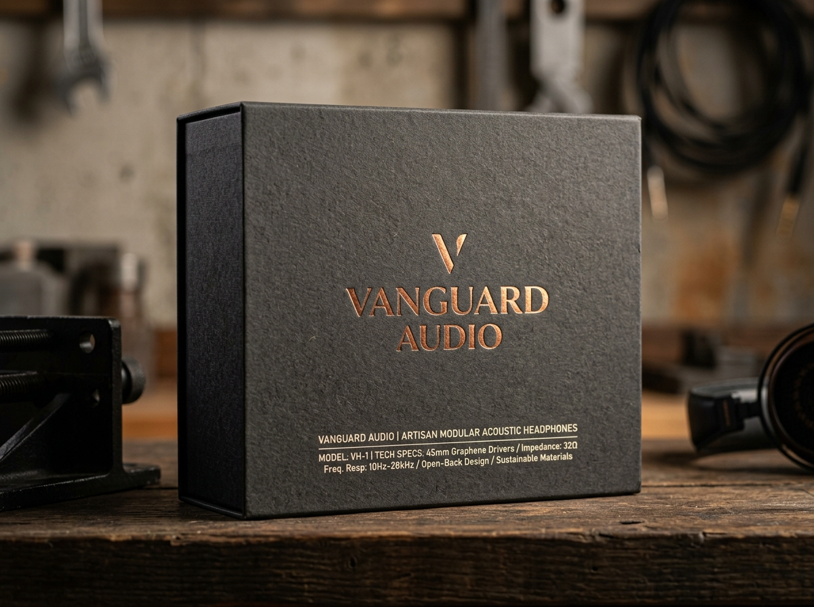

# Vanguard Audio — Brand Identity & Product Launch Campaign

Official submission repository for the **Design Marathon 48-Hour Design Challenge**.



## Brand Profile: Vanguard Audio
Vanguard Audio is a premier, high-fidelity sound hardware brand launching a flagship line of modular acoustic headphones and home audio systems. The brand sits at the intersection of **retro-futuristic minimalism**, **precision acoustic engineering**, and **luxury industrial aesthetics**.

---

## 📁 Repository & Submission Structure

```
.
├── TeamVanguard_.zip                        # Complete compressed submission zip package
├── TeamVanguard_/                           # Standardized deliverable directories
│   ├── 01_Style_Guide/
│   │   ├── Brand_Style_Guide.pdf            # Complete brand guide (Typography, Color, Usage)
│   │   ├── Logo_Primary.svg                 # Primary vector logo lockup
│   │   ├── Logo_Secondary.svg               # Secondary horizontal logo lockup
│   │   ├── Symbol_Mark.svg                  # Standalone symbol emblem
│   │   ├── Compact_Lockup.svg               # Compact device badge
│   │   └── Editable_Sources/                # Vector generation scripts & sources
│   ├── 02_Packaging_and_Merch/
│   │   ├── Packaging_Design.png             # Eco-friendly headphone packaging render
│   │   ├── Merch_Mockups.png                # Heavyweight apparel & lifestyle merch
│   │   └── Editable_Sources/                # Native layout files & high-res renders
│   ├── 03_Digital_UI/
│   │   ├── UI_LandingPage.png               # Landing page UI/UX layout render
│   │   ├── UI_AcousticCraft.png             # Acoustic craft UI/UX layout render
│   │   ├── index.html                       # Responsive HTML5 Landing Page
│   │   ├── acoustic.html                    # HTML5 Acoustic Craft & Sustainability Page
│   │   ├── styles.css                       # CSS Design System
│   │   ├── app.js                           # Audio frequency visualizer & JS logic
│   │   └── Editable_Sources/                # Web UI codebase
│   ├── 04_Product_Collateral/
│   ├── Headphone_Earcup_Pattern.svg      # Vector laser engraving pattern
│   ├── Headphone_Earcup_Pattern.png      # Macro earcup titanium texture render
│   ├── Retail_Display.png                # Pop-up listening sanctuary booth render
│   └── Editable_Sources/                # Laser artwork & booth design sources
│   ├── 05_Campaign_Poster/
│   │   ├── Poster_A2.png                    # "Sound Sanctuary" launch poster render (A2)
│   │   ├── Poster_Print.pdf                 # Print-ready A2 PDF with crop marks
│   │   └── Editable_Sources/                # Layout & typography sources
│   └── 06_Presentation/
│       └── Concept_Presentation.pdf         # Official Pitch Presentation (Strictly 5 Slides)
├── build_vector_assets.py                    # Vector SVG generator
├── build_presentation.py                     # ReportLab 5-slide pitch deck compiler
├── build_style_guide.py                      # Brand style guide PDF generator
├── build_poster_pdf.py                       # A2 print PDF compiler
└── package_submission.py                     # Audit & ZIP build tool
```

---

## 🎨 Design System Summary

### Color Palette
- **Obsidian Dark**: `#0B0C0E` (RGB: `11, 12, 14` | CMYK: `75, 68, 67, 90`)
- **Pure Titanium**: `#E2E4E8` (RGB: `226, 228, 232` | CMYK: `8, 5, 4, 0`)
- **Acoustic Copper**: `#C87D55` (RGB: `200, 125, 85` | CMYK: `20, 56, 73, 8`)
- **Luminescent Amber**: `#FF9500` (RGB: `255, 149, 0` | CMYK: `0, 47, 100, 0`)
- **Studio Slate**: `#17191E` (RGB: `23, 25, 30` | CMYK: `74, 66, 62, 80`)

### Typography
- **Display / Headlines**: *Space Grotesk* / *Syne*
- **Body & Copy**: *Inter* / *Plus Jakarta Sans*
- **Technical Specs**: *JetBrains Mono*

---

## 🚀 Key Features & Highlights
1. **Logo System**: Clean geometric 'V' acoustic soundwave emblem with clear space and usage guidelines.
2. **Product Packaging**: Magnetic unbleached dark charcoal eco-box with embossed copper foil typography.
3. **Web UI App**: Dark glassmorphic digital presence with live frequency spectrum canvas visualizer.
4. **Hardware Customization**: Micro laser-etched concentric acoustic wave pattern applied directly to titanium earcup.
5. **Campaign Poster**: Promotional launch poster for "Sound Sanctuary" event at Shibuya Audio Dome, Tokyo.
6. **Presentation Deck**: Strictly 5-slide PDF pitch deck covering concept, rationale, UI/UX architecture, deliverables showcase, and team contributions.

---

© 2026 Vanguard Audio Labs. Created for Design Marathon.
